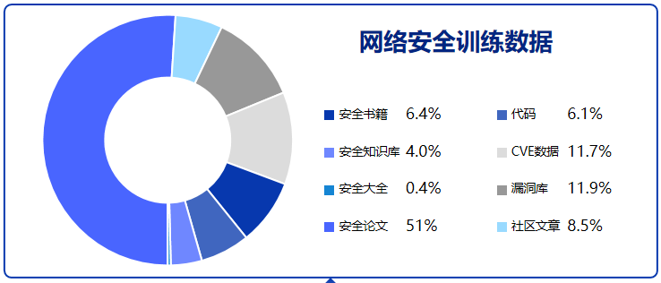
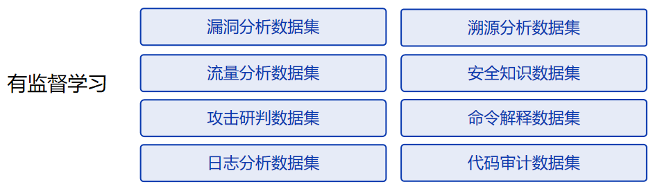

# SecGPT 网络安全大模型

## 训练步骤
### 1. 基座模型：Baichuan-13B
- 基于Baichuan-13B+Lora微调(预训练+SFT微调)
### 2. 微调技术
- 基于Lora做预训练和SFT训练，优化后的训练代码展示了训练的底层知识，同时大幅减少训练的显存占用，在3*4090上训练。
### 3. 数据
- 预训练数据
	- 收集了安全书籍，安全知识库，安全论文，安全社区文章，漏洞库等等安全内容
	- 数据集开源地址：https://huggingface.co/datasets/w8ay/security-paper-datasets
	- 数据分布：
- 有监督数据
	- chatgpt+人工构造各类有监督安全能力数据集，让模型能了解各类安全指令。
	- 
	- 思维链：基于思维链方式构造有监督数据集让模型能够根据问题逐步推理到最终答案，展现推理过程。
	- 知乎回答：加入了部分高质量知乎数据集，在一些开放性问题上模型能通过讲故事举例子等方式回答答案和观点，更易读懂。
	- 为防止灾难性遗忘，有监督数据喂通用能力数据+安全能力数据，数据占比5:1
### 4. 模型训练
### 5. 效果展示