# 🌐 SecGPT：全球首个网络安全开源大模型

## 🔍 模型简介

**SecGPT** 是由 **云起无垠** 于 2023 年正式推出的开源大模型，专为网络安全场景打造，旨在以人工智能技术全面提升安全防护效率与效果。

> ✅ 我们的愿景：推动网络安全智能化，为社会构建更安全的数字空间
>  🚀 我们的使命：让每一家企业，都能拥有一个“懂安全”的智能助手

SecGPT 融合了自然语言理解、代码生成、安全知识推理等核心能力，已成功落地多个关键安全任务场景：

- **🛠 漏洞分析**：理解漏洞成因、评估影响范围、生成修复建议
- **🧭 日志与流量溯源**：还原攻击路径、分析攻击链，辅助事件复盘
- **⚠️ 异常检测**：识别潜在威胁，提升安全感知与响应能力
- **🎯 攻防推理**：服务于红队演练、蓝队分析，支撑实战决策
- **📜 命令解析**：分析攻击脚本，识别意图与高危操作
- **💬 安全知识问答**：团队“即问即答”的知识引擎


## 🔧 最新动态

- **2025年4月**：SecGPT V2.0 发布，全面升级安全理解与任务执行能力
- **2024年3月**：轻量化版本 SecGPT-Mini 正式开源，可在 CPU 上高效运行
- **2023年12月**：SecGPT 正式发布，成为全球首个开源网络安全大模型


## 📂 开源资源

- ##### 模型源码与文档：

  -  https://github.com/Clouditera/secgpt

- **模型下载地址：**

  - HuggingFace:  https://huggingface.co/clouditera/secgpt
  - ModelScope: [即将上线]

- **数据集下载地址：**
  - https://huggingface.co/datasets/clouditera/security-paper-datasets


## 🔧 模型部署

SecGPT 支持通过 vLLM 高性能推理框架部署，适用于 **低延迟、高并发、大吞吐量** 的安全模型服务场景。

环境准备与服务启动：

```shell
# 创建 Python 环境（建议 Python 3.10+）
conda create -n secgpt-vllm python=3.10 -y
conda activate secgpt-vllm

# 安装 vLLM（需具备 PyTorch + CUDA）
pip install --upgrade pip
pip install vllm


# 启动server 服务
CUDA_VISIBLE_DEVICES= xxx(GPU index) \
vllm serve ./secgpt \
  --tokenizer ./secgpt \
  --tensor-parallel-size 4 \
  --max-model-len 32768 \
  --gpu-memory-utilization 0.9 \
  --dtype bfloat16 \
  
# 示例请求
curl http://localhost:8000/v1/chat/completions \
  -H "Content-Type: application/json" \
  -d '{
    "model": "secgpt",
    "messages": [{"role": "user", "content": "什么是 XSS 攻击？"}],
    "temperature": 0.7
  }'
```


## 本轮更新亮点：

### 1. 更强的基座能力：通用+安全深度融合

我们基于 **Qwen2.5-Instruct 系列** 与 **DeepSeek-V2** 模型，结合自建安全任务集与安全知识库， 在 **8台A100 GPU** 集群上持续训练一周以上，完成大规模预训练 + 指令微调 + 强化学习，  显著提升模型在安全场景中的**理解、推理与响应能力**。

下图展示了一次训练过程中各关键指标的演化轨迹：

- **训练与验证损失（train/loss 与 eval/loss）**：二者均呈现出平稳下降趋势，说明模型在训练集与验证集上均持续收敛，未出现过拟合迹象。
- **学习率曲线（train/learning_rate）**：采用典型的 Warmup + 衰减策略，有效提升了早期训练的稳定性与收敛速度。
- **梯度范数（train/grad_norm）**：整体波动平稳，仅在少数步数存在轻微尖峰，未出现梯度爆炸或消失，表明训练过程健康稳定。
- **评估表现**：`eval/runtime` 与 `eval/samples_per_second` 波动范围小，说明在评估过程中系统资源使用高效，推理吞吐量稳定。
- **其他指标**如训练轮数（train/epoch）、输入 token 数量（train/num_input_tokens_seen）等也表明训练过程如期进行，达成预期计划。

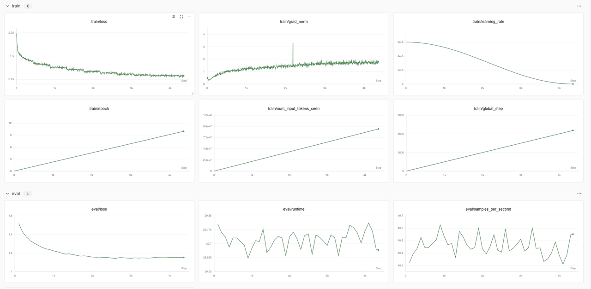

### 2. 更大的高质量安全语料库：私有 + 公共数据双轮驱动

我们已构建了一个超大规模、结构完备的网络安全语料库，总量超过 **5TB**、共计 **106,721 个原始文件**，其中超过 **40% 内容为人工精选与结构化处理**。私有数据部分系统整合了具备 **70+ 字段 / 14 类结构标签体系** 的安全数据资源，经过统一清洗、语义标注与重构，构建出 **数百亿 Tokens 级**的高质量语料，为大模型深度推理能力提供坚实支撑。

下图展示了该语料库的构成维度，整体采集逻辑遵循“**理论支撑 — 实战对抗 — 应用落地**”三层结构体系：

- **理论支撑**：涵盖法律法规、学术论文、行业报告等权威资料，为模型提供稳固的知识基座；
- **实战对抗**：包括漏洞详情、CTF题库、日志流量、恶意样本与逆向分析等数据，提升模型对真实攻击行为的识别与追踪能力；
- **应用落地**：涵盖安全社区博客、教育培训资料、安全知识图谱与自动化策略，增强模型在安全运营、辅助决策等场景中的适配能力。

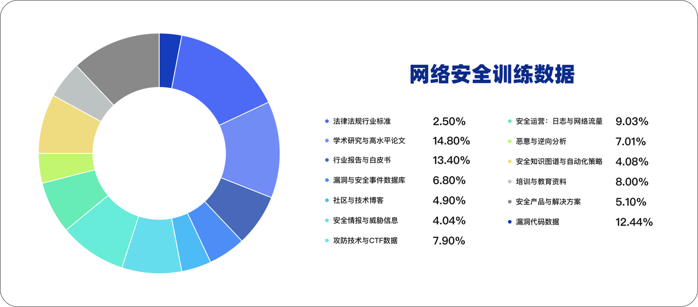


## 🧪 模型评测与能力分析

### 1. 模型能力评测：全面指标跃升，实战智能初现

为全面评估 SecGPT 的安全实战能力，我们构建了一套覆盖**安全证书问答、安全通识、编程能力、知识理解与推理能力**的综合评估体系，主要采用以下标准化数据集：CISSP、CS-EVAL、CEVAL、GSM8K、BBH。

| **评测集名称** | **简要说明**                                                 | **参考链接**                                                 |
| -------------- | ------------------------------------------------------------ | ------------------------------------------------------------ |
| **CISSP**      | 权威信息安全认证体系，考察模型在安全管理、访问控制、风险治理等领域的专业知识覆盖度与答题准确率，适用于评估模型在通用信息安全领域的掌握程度。 | [ISC² 官方网站](https://www.isc2.org/Certifications/CISSP) [认证考试指南](https://web.lib.xjtu.edu.cn/info/1117/6461.htm) |
| **CS-Eval**    | 面向网络安全任务的大模型能力综合评测集，覆盖 11 个网络安全主类、42 个子类，共计 4369 道题目，包含选择题、判断题、知识抽取等题型，兼顾知识性与实战性，用于评估模型的安全通识与任务执行能力。 | [ModelScope 数据集](https://modelscope.cn/datasets/cseval/cs-eval/)  [论文介绍 (arXiv)](https://arxiv.org/abs/2411.16239) |
| **C-Eval**     | 中文能力评估。由上海交通大学、清华大学和爱丁堡大学的研究人员在2023年5月联合推出。包含13948个多项选择题，涵盖了52个不同的学科和四个难度级别。 | [论文链接 (arXiv)](https://arxiv.org/abs/2305.08322)  [CSDN 实践介绍](https://blog.csdn.net/2401_85343303/article/details/139698577) |
| **GSM8K**      | 解决数学问题的能力。Google开发的一个数学问题求解数据集，包含大约8,000个高中到大学水平的数学问题。 | [GSM8K ](https://github.com/openai/grade-school-math) [GitHub](https://github.com/openai/grade-school-math) |
| **BBH**        | 复杂语言理解能力。由Google、斯坦福等研究人员开发的数据集，包含大量复杂语言理解任务的集合，可能包含需要深度推理、常识运用或复杂认知技能的任务。 | [论文链接 (arXiv)](https://arxiv.org/abs/2206.04615)         |

在与原始模型 SecGPT-mini 的对比中，训练后的模型在所有指标上均实现大幅跃升，具体如下：

#### 1.1 模型纵向评测对比

| **模型版本**    | **CISSP**    | **CS-EVAL**   | **CEVAL**    | **GSM8K**    | **BBH**      |
| --------------- | ------------ | ------------- | ------------ | ------------ | ------------ |
| **SecGPT-mini** | 25.67        | 39.64         | 37.50        | 3.87         | 21.80        |
| **SecGPT-1.5B** | 71.09🔺+45.42 | 81.53 🔺+41.89 | 53.5 🔺+16.00 | 57.47🔺+53.60 | 45.17🔺+23.37 |
| **SecGPT-7B**   | 78.23🔺+52.97 | 85.12 🔺+45.48 | 72.89🔺+35.39 | 76.88🔺+73.01 | 67.08🔺+45.28 |
| **SecGPT-14B**  | 77.37🔺+51.70 | 86.12 🔺+46.48 | 59.45🔺+29.95 | 88.25🔺+84.38 | 75.90🔺+54.10 |

📈 **能力跃升解读：**

- **mini → 1.5B**：具备“能答对”的基础问答能力，适配中低复杂度任务；
- **1.5B → 7B**：推理深度、泛化能力显著增强，能理解任务意图并构建较为完整的解决路径；
- **7B → 14B**：能力跃迁至“类专家”级，能够处理高复杂度推理、安全策略制定等高阶任务。

#### 1.2 模型横向评测对比

相较于基础模型 Qwen2.5-Instruct，SecGPT 在所有评测指标上均实现实质性超越，反映出我们在数据构建、微调范式、安全任务精调机制上的整体优化成效：

| 模型版本         | **CISSP**  ↑ | **CS-EVAL  ↑** | **CEVAL ↑** | **GSM8K ↑** | **BBH ↑** |
| ---------------- | ------------ | -------------- | ----------- | ----------- | --------- |
| **Qwen2.5-1.5B** | 52.97        | 71.66          | 59.91       | 61.03       | 43.44     |
| **SecGPT-1.5B**  | 71.09        | 81.53          | 53.5        | 57.47       | 45.17     |
| **Qwen2.5-7B**   | 66.30        | 84.66          | 74.97       | 80.36       | 71.20     |
| **SecGPT-7B**    | 78.23        | 85.12          | 72.89       | 76.88       | 67.08     |
| **Qwen2.5-14B**  | 71.09        | 86.22          | 68.57       | 90.03       | 78.25     |
| **SecGPT-14B**   | 77.37        | 86.12          | 59.45       | 88.25       | 75.90     |

💡 **洞察亮点：**

- 在 CISSP 和 CS-EVAL 等安全类数据集上，SecGPT 在所有参数规模下均表现优于 Qwen2.5 同规格版本；
- 表明我们构建的安全任务指令集与精调策略已显著提升模型的实战应用能力与专业问答深度。

### 2. 安全能力提升：更全、更准、更专业

本轮升级中，SecGPT 在安全知识问答方面完成了从**信息整合**到**逻辑输出**的能力跃迁，具体体现在：

- **知识覆盖更全面**：引入了涵盖法律法规、攻击战术、逆向分析等14类安全知识领域的结构化语料；
- **答案生成更精准**：通过多轮对话控制与语义优化技术，提升了问答对齐率与上下文记忆稳定性；
- **推理能力更突出**：具备多段知识联结与复合逻辑推演能力，能完成如攻击链分析、威胁研判等复杂任务。

#### 2.1 渗透测试场景能力：

SecGPT 能够模拟渗透攻击流程，从信息收集、漏洞利用到提权横向，具备关键工具命令分析、Payload 构造、利用链生成等能力。

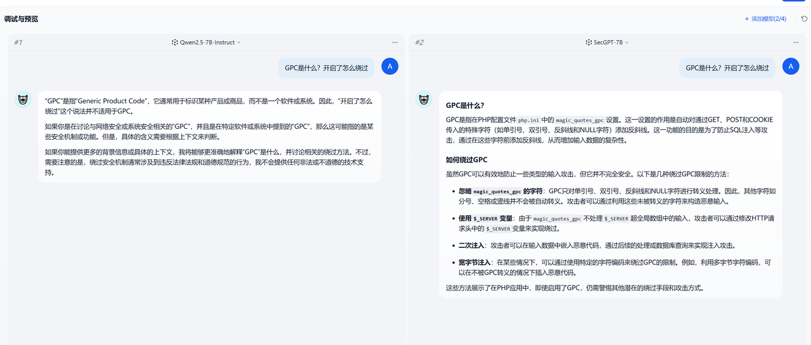

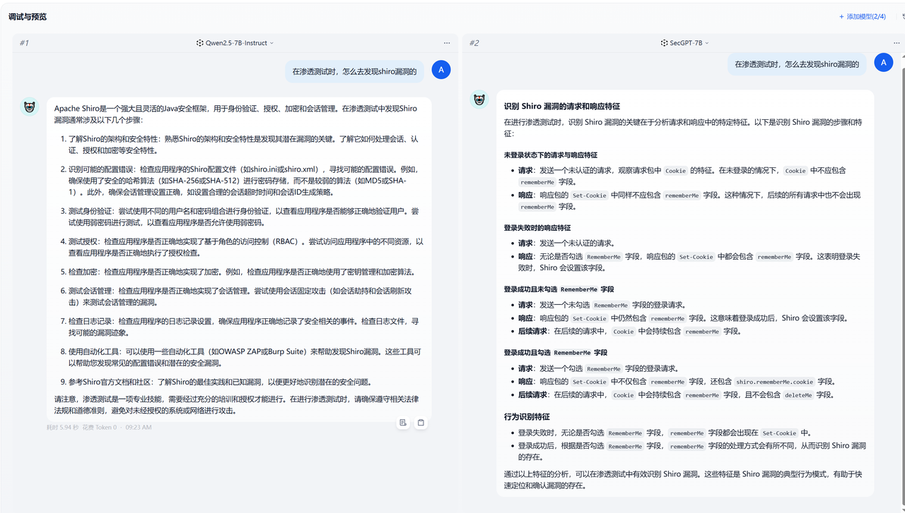

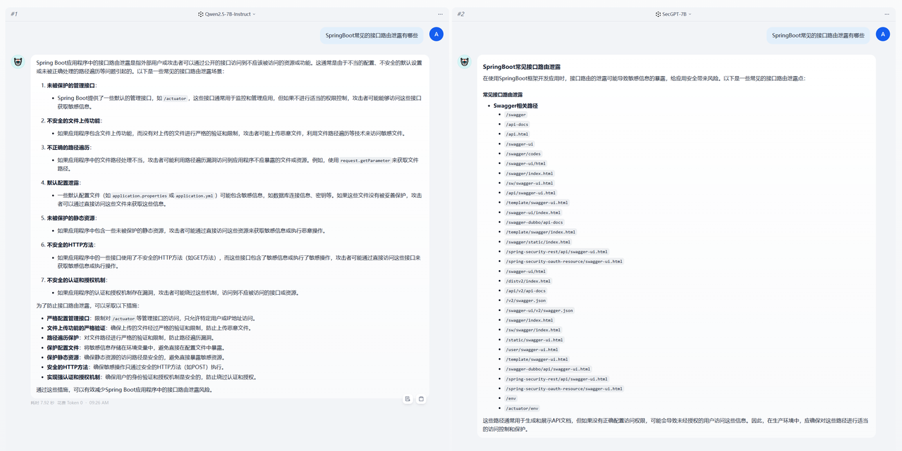

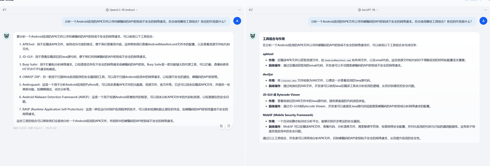

#### 2.2  日志分析和流量分析能力

在安全日志与网络流量场景下，SecGPT 能自动识别异常事件、构建攻击链图谱、抽取关键 IOC（Indicator of Compromise），辅助完成事件溯源与告警分类。

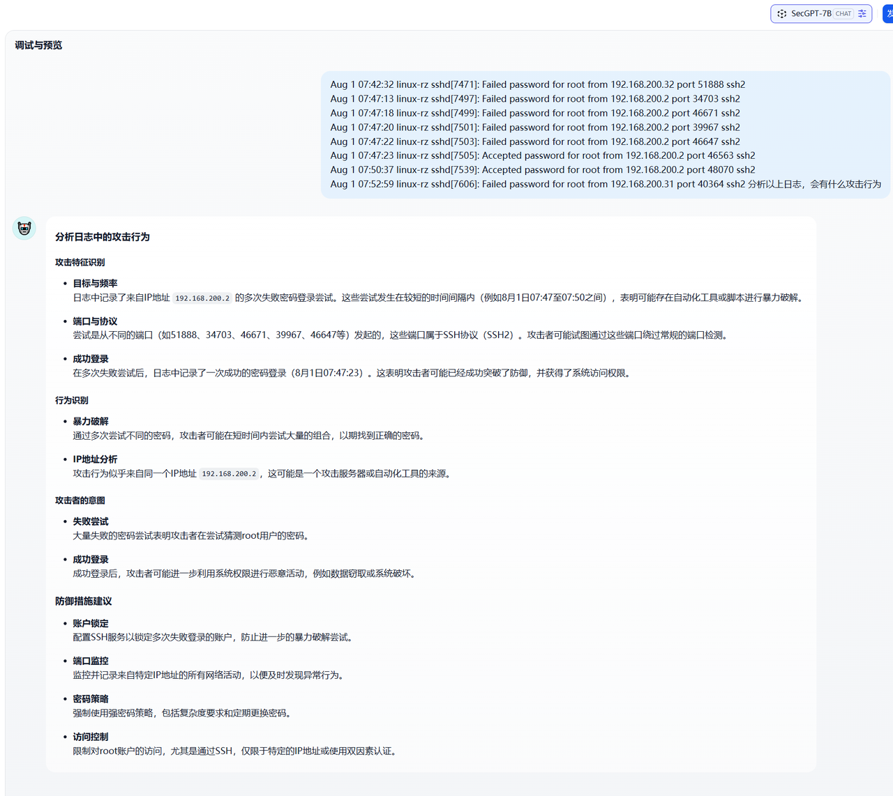

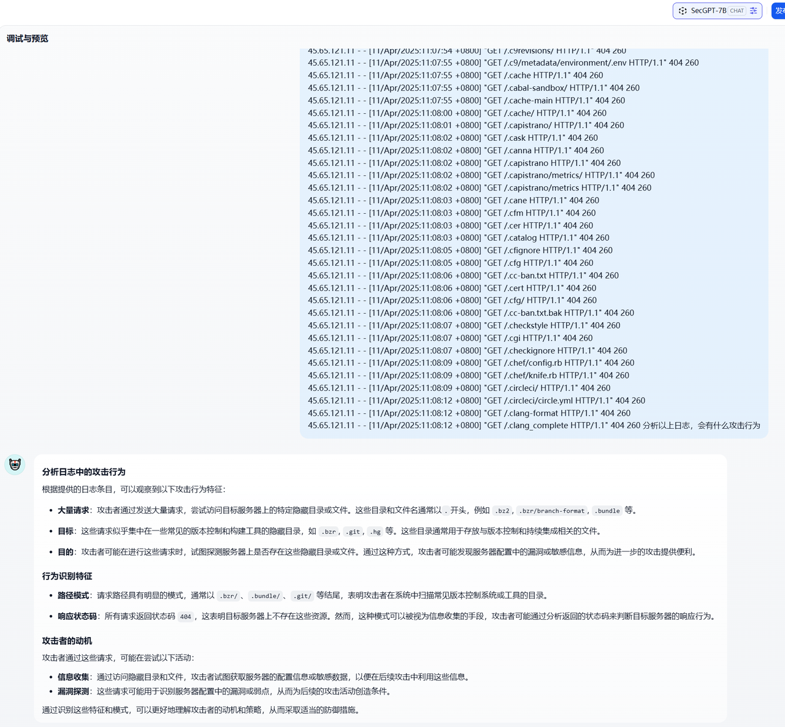

#### 2.3 逆向分析能力

基于对反汇编、API 调用序列、加壳行为等低层数据的理解，SecGPT 能辅助完成恶意样本的静态分析、特征提取与家族归类，具备一定的逆向辅助解读能力。

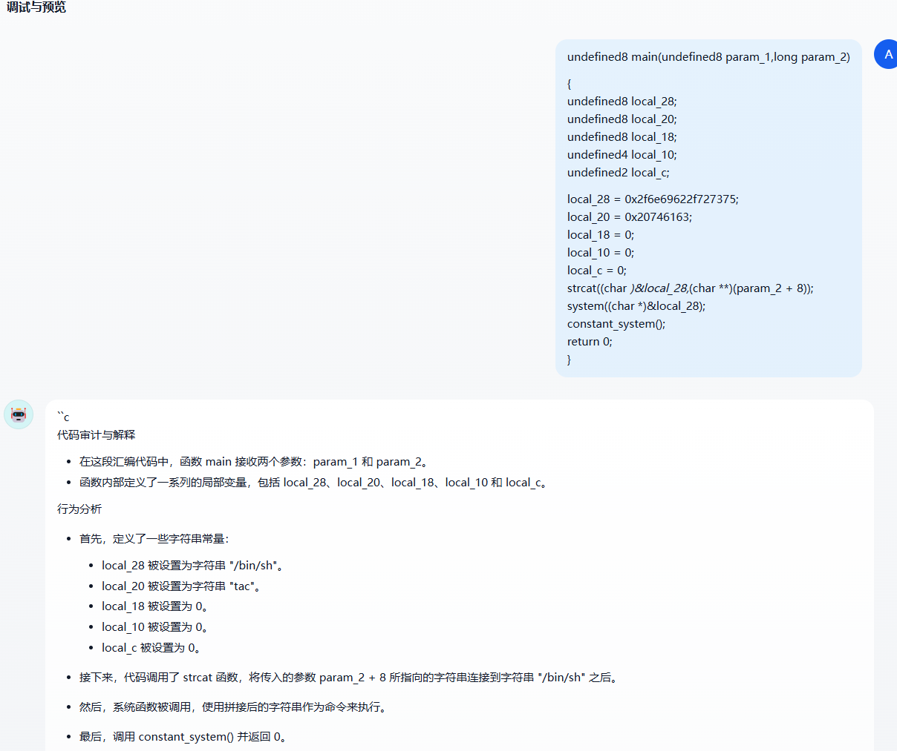

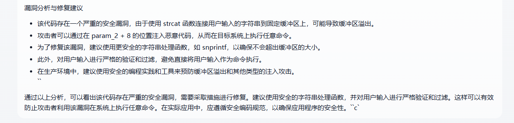

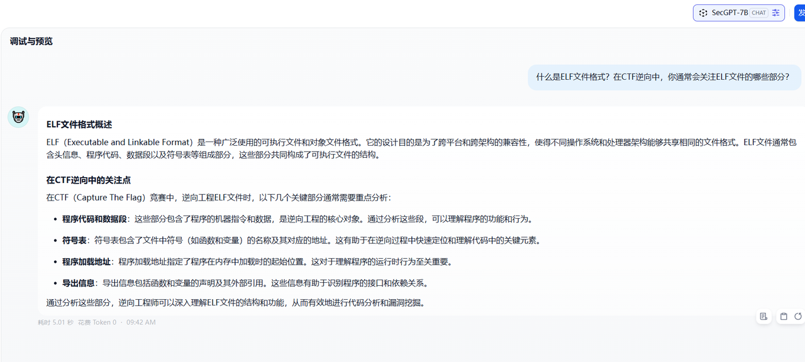

#### 2.4 代码审计能力

```typescript
import java.util.*;
import java.util.stream.Collectors;

public class AverageCalculator {

    public static double calculateAverage(Object input, boolean strict) {
        if (strict) {
            System.out.println("Running in STRICT mode");

           
            @SuppressWarnings("unchecked")
            List<Number> numbers = (List<Number>) input;
            double total = 0;
            for (Number num : numbers) {
                total += num.doubleValue();
            }
            return total / numbers.size();
        } else {
            System.out.println("Running in SAFE mode");

            List<Double> parsed = parseInputSafe(input);
            double total = parsed.stream().mapToDouble(Double::doubleValue).sum();
            return total / parsed.size();
        }
    }

   
    public static List<Double> parseInputSafe(Object input) {
        List<Double> result = new ArrayList<>();

        if (input instanceof String) {
            String s = (String) input;
            if (!s.matches("\\d+")) {
                throw new IllegalArgumentException("String must contain only digits.");
            }
            for (char c : s.toCharArray()) {
                result.add(Double.parseDouble(String.valueOf(c)));
            }
        } else if (input instanceof List<?>) {
            for (Object obj : (List<?>) input) {
                try {
                    result.add(Double.parseDouble(obj.toString()));
                } catch (NumberFormatException e) {
                    throw new IllegalArgumentException("Invalid element in list: " + obj);
                }
            }
        } else {
            throw new IllegalArgumentException("Unsupported input type: " + input.getClass());
        }

        return result;
    }

   
    public static void main(String[] args) {
        List<TestCase> testCases = Arrays.asList(
            new TestCase("12345", false),
            new TestCase("12345", true),           
            new TestCase(Arrays.asList(1, 2, "3", "4"), false),
            new TestCase(Arrays.asList(1, 2, 3, "four"), false),
            new TestCase(Arrays.asList(1, 2, 3, "four"), true)   
        );

        for (int i = 0; i < testCases.size(); i++) {
            TestCase tc = testCases.get(i);
            System.out.println("\n--- Test Case " + (i + 1) + " | strict=" + tc.strict + " ---");
            try {
                double avg = calculateAverage(tc.input, tc.strict);
                System.out.println("✅ Average: " + avg);
            } catch (Exception e) {
                System.out.println("❌ Error: " + e.getMessage());
            }
        }
    }

   
    static class TestCase {
        Object input;
        boolean strict;

        TestCase(Object input, boolean strict) {
            this.input = input;
            this.strict = strict;
        }
    }
}
```

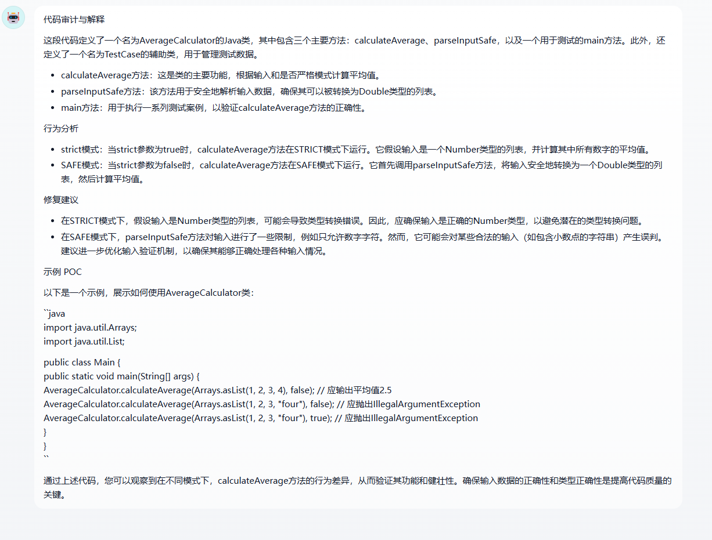

#### 2.5 工具使用

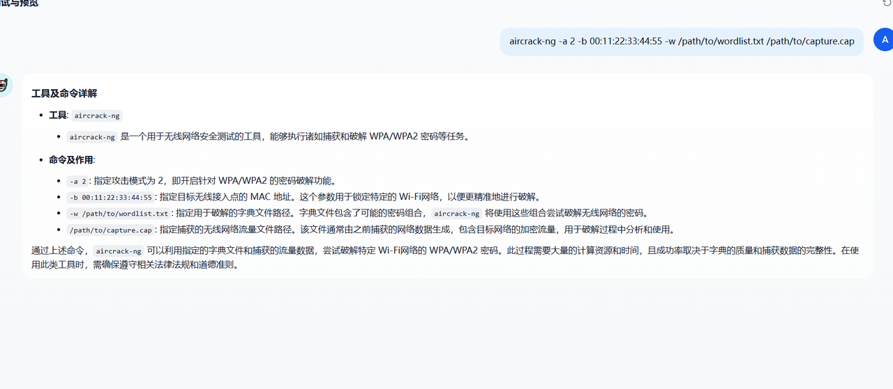

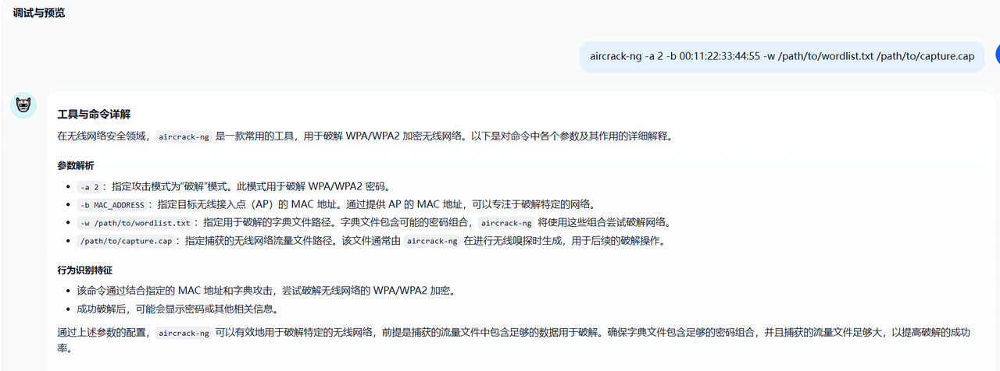


## 📮 联系我们
<div align=center>
</div>
SecGPT 是一个面向网络安全领域的大模型开源项目，我们相信开放、协作、共享的力量，能够不断推动行业智能化进程。

我们诚挚邀请全球的安全研究者、工程师、爱好者共同参与 SecGPT 的建设与优化：

- 🧠 提出使用建议或功能需求
- 🐞 反馈问题并提交 Issue
- 💻 贡献代码与安全任务数据集
- 📢 参与使用经验交流与最佳实践分享

📬 若您对模型有任何疑问或合作意向，欢迎通过 GitHub 参与贡献或联系云起无垠团队。我们期待与更多志同道合的伙伴一起，共建“真正懂安全”的 AI 系统。

## ⭐ Star History

[](https://star-history.com/#Clouditera/secgpt&Date)

## ⚠️ 免责声明

在使用 SecGPT 时，请您注意以下事项：

- 本项目为研究与交流目的所构建，输出内容可能受限于模型训练数据的覆盖范围；
- 用户在使用模型过程中，应自行判断其输出的正确性与适用性；
- 若您计划将本模型用于 **公开发布或商业化部署**，请务必明确承担相关法律和合规责任；
- 本项目的开发者对因使用本模型（包括但不限于模型本身、训练数据、输出内容）所可能产生的任何直接或间接损害概不负责。


